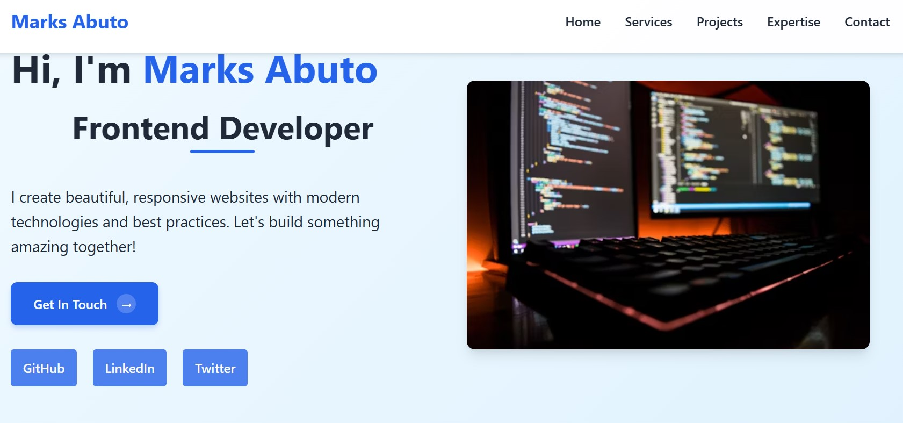

# Marks Abuto - Portfolio Website

 

A modern, responsive portfolio website showcasing my skills, projects, and professional information. Built with pure HTML and CSS for optimal performance.

## Features

- **Fully Responsive Design**: Adapts to all screen sizes
- **Interactive Elements**:
  - Animated buttons with hover effects
  - Interactive project cards
  - Smooth scrolling navigation
- **Sections**:
  - Hero section with call-to-action
  - Services/Expertise showcase
  - Project gallery
  - Contact form
- **Performance Optimized**: No JavaScript, fast loading
- **Accessibility Focused**: Semantic HTML and proper contrast

## Technologies Used

- HTML5 (Semantic markup)
- CSS3 (Variables, Flexbox, Grid, Animations)
- Responsive Design (Mobile-first approach)
- CSS Animations & Transitions

## Installation

No installation required - this is a static website. Simply open `index.html` in any modern browser.

Connect with me:

GitHub: https://github.com/marksabuto

LinkedIn: https://www.linkedin.com/in/marks-abuto/

Twitter: https://x.com/marksabuto
